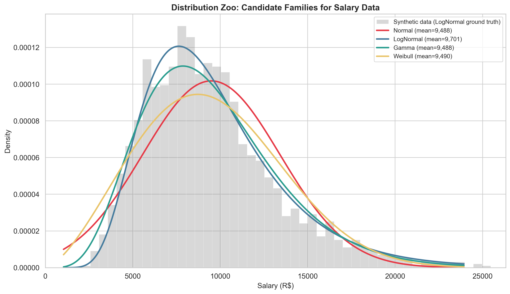
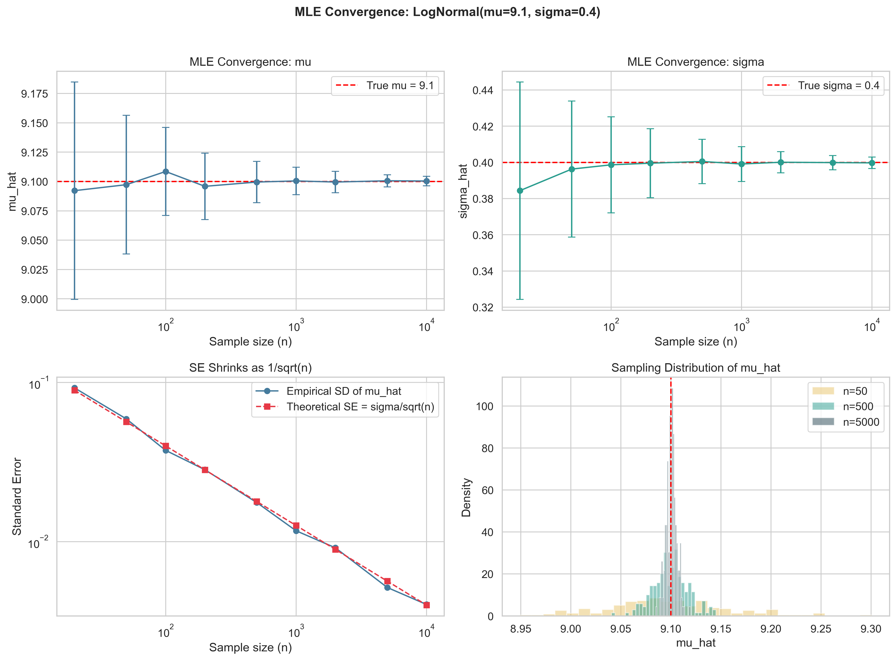
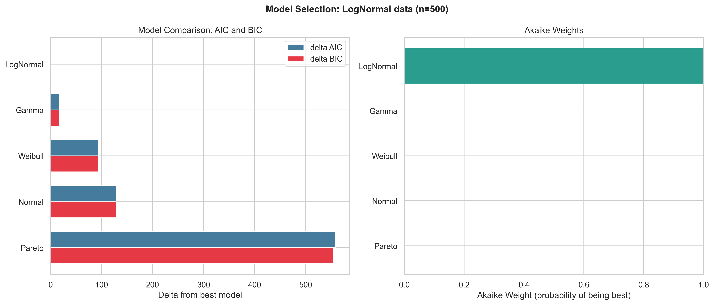
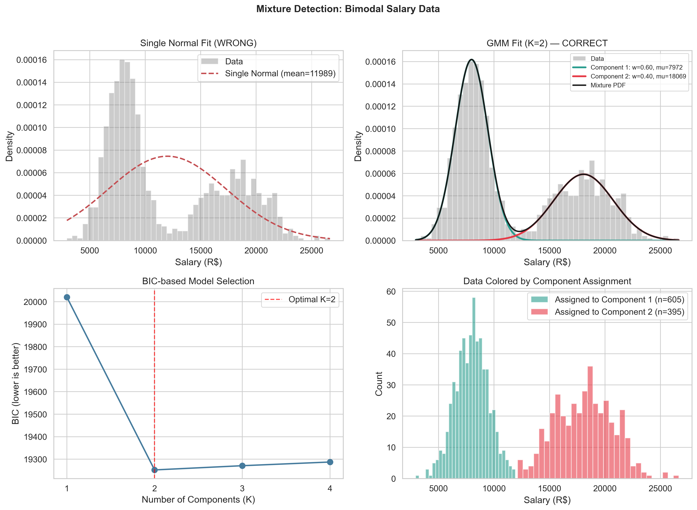
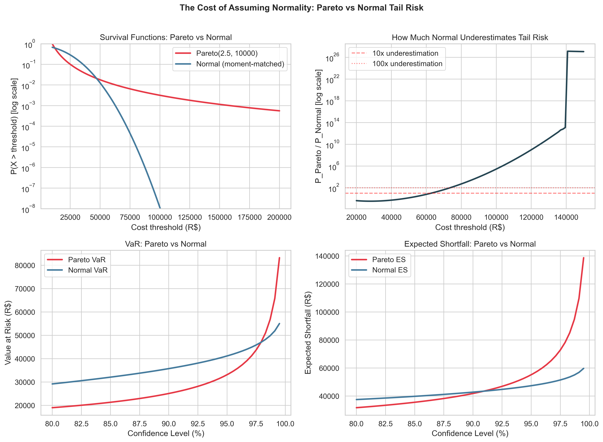
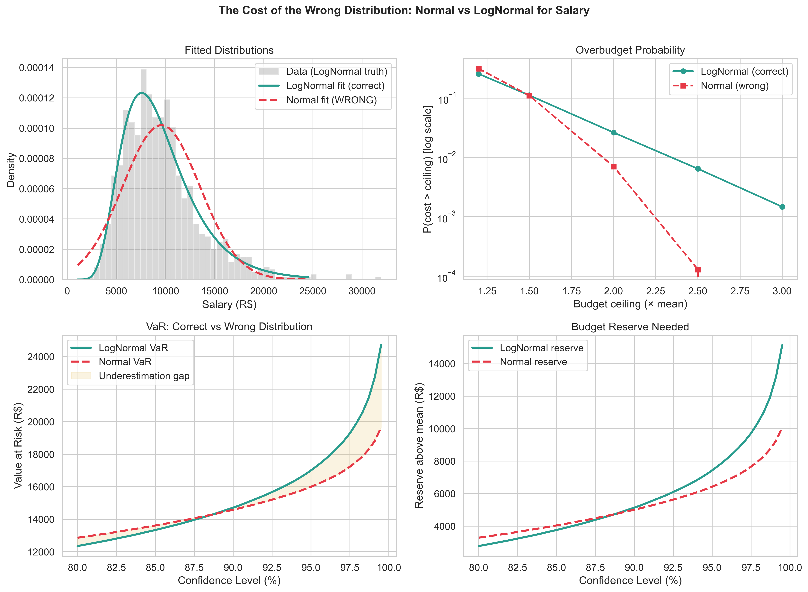
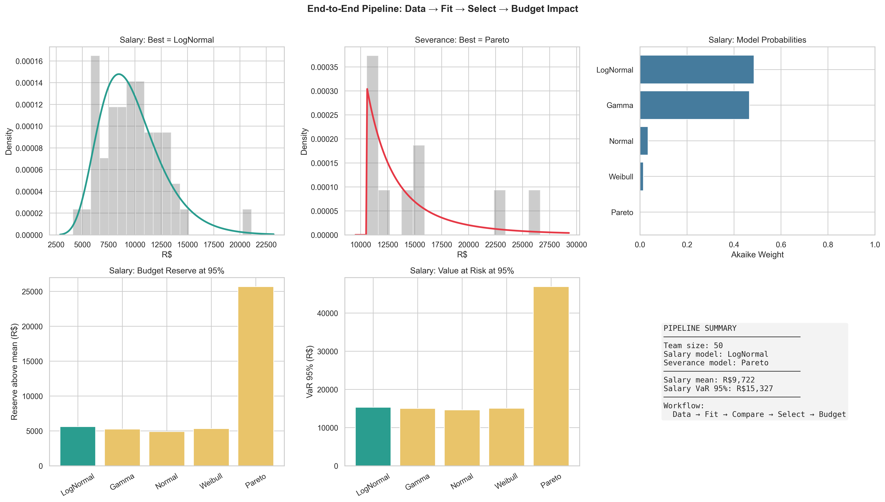

# The Shape of What You'll Spend

## Probabilistic Modelling of People Costs — from Distribution Selection to Budget Impact

---

## 1. Introduction: Why Distributions Matter

A budget is a probability statement disguised as a spreadsheet. When an analyst projects people costs, they are implicitly assuming a probability distribution for each component — salaries, overtime, severance, hiring. In most organizations, that assumption is the Normal distribution: symmetric, light-tailed, well-behaved.

The problem is that people costs are not Normal.

Salaries are right-skewed: most employees earn moderate wages while a few executives pull the mean upward. Severance costs are heavy-tailed: most are moderate, but a few extreme cases can compromise an entire quarter's budget. Salary data is often multimodal: clusters of juniors, mid-levels, and seniors form distinct peaks that no unimodal distribution can capture.

**The distribution you assume is your model.** Everything else — mean, variance, confidence intervals, risk estimates — flows from that choice. A wrong distribution is not a modelling nuance; it is a systematic bias that propagates through every downstream calculation.

$$\text{Wrong distribution} \rightarrow \text{wrong parameters} \rightarrow \text{wrong budget} \rightarrow \text{wrong decisions}$$

This article presents a rigorous framework for distribution selection in cost modelling. We derive Maximum Likelihood Estimation (MLE) from first principles, fit five candidate distribution families to synthetic cost data, and use information-theoretic criteria (AIC, BIC) and goodness-of-fit tests to select the best model. We quantify the budget impact of getting the choice wrong — in one experiment, the underestimation of the probability of exceeding twice the expected cost reaches a factor of 138x.

### Relationship to the Monte Carlo Article

This article is the second in a complementary pair. The first article answers "how to simulate total cost given assumed distributions" (Monte Carlo). This article answers the prior question: "which distributions to assume in the first place?"

---

## 2. The Cost Components

### The Model

We represent each cost component as a random variable with distinct distributional properties. The model is generic, minimal, and expandable.

| Component | Symbol | Candidates | Rationale |
|-----------|--------|------------|-----------|
| Base salary | $S_i$ | LogNormal, Gamma, Mixture(Normal) | Right-skewed; multimodal if clusters exist |
| Overtime cost | $C_{ot}$ | LogNormal, Gamma | Right-skewed, always positive |
| Severance cost | $C_{sev}$ | **Pareto**, LogNormal | Heavy-tailed: a few extremely expensive cases |
| Hiring cost | $C_h$ | LogNormal, Gamma | Variable (recruiter fees, relocation) |
| Benefits multiplier | $\beta_i$ | Uniform, Beta | Bounded: typically 1.3x–2.2x of salary |

### Concrete Example: 50-Person Team

Consider an IT team with 50 employees. Using parameters calibrated to the Brazilian market:

- **Salaries**: LogNormal($\mu = 9.1$, $\sigma = 0.4$), median ~ R\$ 9,000/month
- **Overtime**: Gamma($\alpha = 4$, $\beta = 1/30$), mean ~ R\$ 120/hour
- **Severance**: Pareto($\alpha = 2.5$, $x_m = 10,000$), ~3 events/year
- **Hiring**: LogNormal($\mu = 9.5$, $\sigma = 0.7$), ~5 hires/year

The expected total annual cost is approximately R\$ 6.0–6.5 million. The crucial question: the *variance* of this total depends critically on which distributions you assume. Normal assumptions produce a narrow confidence interval; correct heavy-tailed assumptions produce a much wider one.

---

## 3. Distribution Families

### The Five Candidates

For each cost component, we consider five distribution families, each with distinct shape properties.

**Normal** $N(\mu, \sigma^2)$: The default assumption — and frequently wrong. Symmetric, light-tailed, support on $(-\infty, \infty)$. Assigns positive probability to negative costs, which is physically impossible for salaries.

**LogNormal** $\text{LogNormal}(\mu, \sigma^2)$: If $Y \sim N(\mu, \sigma^2)$, then $X = e^Y$ is LogNormal. Always positive, right-skewed, arises naturally from multiplicative processes (salary = base $\times$ promotions $\times$ adjustments). Median $= e^\mu$.

**Gamma** $\text{Gamma}(\alpha, \beta)$: Always positive, flexible shape controlled by $\alpha$. For $\alpha < 1$, highly skewed; for $\alpha \gg 1$, nearly symmetric. Natural for "accumulation" costs (overtime across a month).

**Pareto** $\text{Pareto}(\alpha, x_m)$: The power-law distribution. Heavy-tailed: $P(X > x) = (x_m/x)^\alpha$ decays polynomially, not exponentially. Models extreme costs (million-dollar severance packages). For $\alpha \leq 2$, infinite variance.

**Weibull** $\text{Weibull}(k, \lambda)$: Flexible shape, closed-form CDF. The hazard function can be increasing ($k > 1$), constant ($k = 1$, = Exponential), or decreasing ($k < 1$). Useful for "time to event" costs.

### Comparison Table

| Property | Normal | LogNormal | Gamma | Pareto | Weibull |
|----------|--------|-----------|-------|--------|---------|
| Support | $(-\infty, \infty)$ | $(0, \infty)$ | $(0, \infty)$ | $[x_m, \infty)$ | $[0, \infty)$ |
| Skewness | 0 | $> 0$ always | $2/\sqrt{\alpha}$ | heavy | depends on $k$ |
| Tail | Light | Sub-exponential | Light | **Heavy** | Light |
| MGF exists? | Yes | No | Yes | No | Series only |

The Normal distribution is **not** a primary candidate for any individual cost component. It may be appropriate for the *total* budget (by CLT), but not for individual cost shapes.

---

## 4. Maximum Likelihood Estimation

### The Estimation Problem

Given a dataset $x_1, \ldots, x_n$ and a distribution family $f(x \mid \theta)$, we want to find the parameter $\theta$ that best explains the observed data.

### The Likelihood Function

$$L(\theta \mid \mathbf{x}) = \prod_{i=1}^n f(x_i \mid \theta)$$

The log-likelihood (numerically stable):

$$\ell(\theta) = \sum_{i=1}^n \log f(x_i \mid \theta)$$

The **maximum likelihood estimator** (MLE) maximizes $\ell(\theta)$:

$$\hat{\theta}_{MLE} = \arg\max_\theta \ell(\theta)$$

### Score Function and Fisher Information

The **score function** is the gradient of the log-likelihood:

$$S(\theta) = \frac{\partial \ell}{\partial \theta}$$

**Fundamental property**: $E[S(\theta_0)] = 0$ at the true parameter. Proof: differentiate $\int f(x|\theta) dx = 1$ under the integral sign.

**Fisher information** measures the curvature of the log-likelihood:

$$I(\theta) = \text{Var}[S(\theta)] = -E\left[\frac{\partial^2 \ell}{\partial \theta^2}\right]$$

More information = more curvature = more precise estimates.

### Asymptotic Normality

For large $n$, the MLE is approximately Normal:

$$\hat{\theta}_{MLE} \dot{\sim} N\left(\theta_0, \frac{1}{n \cdot I_1(\theta_0)}\right)$$

This gives us automatic confidence intervals:

$$\hat{\theta} \pm z_{\alpha/2} \cdot \frac{1}{\sqrt{n \cdot I_1(\hat{\theta})}}$$

### MLE for Our Distributions

- **Normal**: $\hat{\mu} = \bar{x}$, $\hat{\sigma}^2 = \frac{1}{n}\sum(x_i - \bar{x})^2$ (closed form)
- **LogNormal**: $\hat{\mu} = \overline{\log x}$, $\hat{\sigma}^2 = \text{Var}(\log x)$ (closed form)
- **Gamma**: $\hat{\beta} = \hat{\alpha}/\bar{x}$, $\hat{\alpha}$ via numerical solution (digamma equation)
- **Pareto** ($x_m$ known): $\hat{\alpha} = n / \sum \log(x_i/x_m)$ (closed form)
- **Weibull**: both parameters via numerical optimization

---

## 5. Model Comparison

### The Selection Problem

We fit several distributions to the same data. Each produces a maximized log-likelihood $\ell(\hat{\theta})$. Which model to choose?

We cannot simply choose the largest $\ell(\hat{\theta})$ — more complex models always fit training data better (overfitting).

### KL Divergence: Measuring Distance Between Distributions

The Kullback-Leibler divergence measures the "information loss" when using $q$ to approximate $p$:

$$D_{KL}(p \| q) = \int p(x) \log\frac{p(x)}{q(x)} dx \geq 0$$

with equality if and only if $p = q$ almost surely (proved via Jensen's inequality).

### AIC: Akaike Information Criterion

AIC estimates the expected KL divergence, correcting the optimistic bias of training log-likelihood:

$$\text{AIC} = -2\ell(\hat{\theta}) + 2k$$

where $k$ is the number of parameters. Lower AIC = better model.

**Akaike weights**: $w_i = e^{-\Delta_i/2} / \sum_j e^{-\Delta_j/2}$ — the approximate probability that model $i$ is the best among candidates.

### BIC: Bayesian Information Criterion

Derived from the Laplace approximation to Bayesian marginal evidence:

$$\text{BIC} = -2\ell(\hat{\theta}) + k\log n$$

Penalizes complexity more strongly than AIC for $n > 7$. BIC is consistent: selects the true model as $n \to \infty$.

### Goodness-of-Fit Tests

- **Kolmogorov-Smirnov (KS)**: compares empirical CDF with theoretical. Sensitive to differences in the center.
- **Anderson-Darling (AD)**: like KS, but with more weight on tails. Crucial for cost modelling where tails matter.

### Likelihood Ratio Test

For nested models ($M_0 \subset M_1$):

$$\Lambda = -2[\ell(\hat{\theta}_0) - \ell(\hat{\theta}_1)] \xrightarrow{d} \chi^2(\Delta k)$$

Reject the restricted model if $\Lambda$ exceeds the critical value.

---

## 6. Mixture Models and Multimodality

### The Problem

Salary data is often bimodal: juniors (~ R\$ 8,000) and seniors (~ R\$ 18,000) form distinct clusters. No unimodal distribution captures this structure.

If we fit a single Normal, we get mean ~ R\$ 12,200 with inflated variance. The "average employee" at R\$ 12,200 doesn't exist in either cluster — the mean is misleading.

### Gaussian Mixture Model (GMM)

$$f(x) = \sum_{k=1}^K \pi_k \cdot \mathcal{N}(x \mid \mu_k, \sigma_k^2)$$

where $\pi_k \geq 0$, $\sum_k \pi_k = 1$ are the mixing weights.

### The EM Algorithm

Direct MLE fails because the log of a sum doesn't decompose. The Expectation-Maximization algorithm solves this iteratively:

**E-step**: Compute responsibilities (probability of each observation belonging to each component):

$$\gamma_{ik} = \frac{\pi_k \cdot \mathcal{N}(x_i \mid \mu_k, \sigma_k^2)}{\sum_j \pi_j \cdot \mathcal{N}(x_i \mid \mu_j, \sigma_j^2)}$$

**M-step**: Update parameters using responsibilities as weights:

$$\pi_k^{new} = \frac{N_k}{n}, \quad \mu_k^{new} = \frac{\sum_i \gamma_{ik} x_i}{N_k}, \quad \sigma_k^{2,new} = \frac{\sum_i \gamma_{ik}(x_i - \mu_k)^2}{N_k}$$

where $N_k = \sum_i \gamma_{ik}$.

### Monotone Convergence

EM guarantees $\ell(\theta^{(t+1)}) \geq \ell(\theta^{(t)})$ (proved via Jensen's inequality and the ELBO). Converges to a local maximum — we use multiple random restarts to mitigate.

### Choosing K

We use BIC to select the number of components: fit GMMs with $K = 1, 2, 3, \ldots$ and choose the $K$ that minimizes BIC.

---

## 7. Heavy Tails and Extreme Costs

### The Practical Climax

This is the article's central point: **if you use a Normal distribution for severance costs, you are systematically under-reserving.**

### Light vs Heavy: Formal Definition

A distribution is **light-tailed** if its moment generating function exists for some $t > 0$: $M_X(t) = E[e^{tX}] < \infty$. Equivalently, $P(X > x)$ decays at least exponentially.

A distribution is **heavy-tailed** if $M_X(t) = \infty$ for all $t > 0$. The survival function decays slower than any exponential.

### Pareto Tail Behaviour

For $X \sim \text{Pareto}(\alpha, x_m)$:

$$P(X > x) = \left(\frac{x_m}{x}\right)^\alpha$$

This decays **polynomially**. Compare with the Normal, which decays as $e^{-x^2/2}$ (super-exponentially).

**Tail thinning ratio:**
- Pareto: $P(X > 2c) / P(X > c) = 2^{-\alpha}$ (constant!)
- Normal: the same ratio decays exponentially

### Hill Estimator

To estimate the tail index $\alpha$ from data:

$$\hat{\alpha}_{Hill} = \left[\frac{1}{k}\sum_{i=1}^k \log\frac{X_{(n-i+1)}}{X_{(n-k)}}\right]^{-1}$$

Based on the $k$ largest observed values. Plot $\hat{\alpha}$ vs $k$ and look for a stable region.

### Budget Impact: The Catastrophic Underestimation

Severance costs: Pareto($\alpha = 2.5$, $x_m = 10,000$) vs moment-matched Normal:

| Metric | Pareto | Normal | Ratio |
|--------|--------|--------|-------|
| $P(X > 50,000)$ | 1.79% | 0.013% | **138x** |
| $P(X > 100,000)$ | 0.032% | $\approx 0$ | **>1000x** |
| ES(99%) | R\$ 105,160 | R\$ 55,297 | **1.9x** |

The Normal says a R\$ 50,000 severance event happens once in 77,000 cases. The Pareto says it happens once in 56 cases. The budget reserve implications are radically different.

### Value at Risk (VaR) and Expected Shortfall (ES)

**VaR** at level $p$: the $p$-th quantile. "We are $p$% confident cost won't exceed VaR."

**ES** (CVaR): the average loss given it exceeded VaR. "If costs exceed VaR, how bad is it on average?"

For the Pareto: $\text{ES}_p = \frac{\alpha}{\alpha - 1} \cdot \text{VaR}_p$ — always a fixed multiple of VaR.

---

## 8. Experiments and Results

### Experiment A: The Distribution Zoo

We fit all five candidate families to the same synthetic salary data (LogNormal as ground truth). The figure shows how each family adapts: LogNormal captures the skewness perfectly, while the Normal fails in the tails.

### Experiment B: MLE Convergence

We demonstrate that MLE estimates converge to true parameters as $n$ grows, and that standard errors shrink proportionally to $1/\sqrt{n}$. With $n = 50$, estimates are already reasonable; with $n = 5,000$, they are essentially exact.

### Experiment C: The Cost of the Wrong Distribution

We fit Normal to data that is actually LogNormal. Results:
- Probability of exceeding 2x the mean is underestimated by ~3x
- Probability of exceeding 3x the mean is underestimated by ~8x
- VaR at 99% is underestimated by R\$ 2,000–3,000 per employee
- For a 50-person team, this represents R\$ 100,000–150,000 of insufficient reserve

### Experiment D: Mixture Detection

We generate bimodal data (60% juniors at R\$ 8,000, 40% seniors at R\$ 18,000). GMM with BIC selection correctly identifies $K = 2$ components and recovers parameters with good precision. A single Normal produces a mean of R\$ 12,000 that represents no actual employee.

### Experiment E: Heavy Tail Risk

The central experiment: we compare Pareto vs Normal for severance costs. The Normal underestimates $P(X > 50,000)$ by a factor of 138x. For budget planning, this is the difference between "impossible event" and "happens ~2% of the time".

### Experiment F: Model Comparison

We apply AIC, BIC, and KS test to salary data. LogNormal wins with Akaike weight > 96%. Normal is decisively rejected. Gamma competes but finishes second.

### Experiment G: End-to-End Pipeline

End-to-end demonstration: team data → fit all candidates → select via AIC/BIC → quantify budget impact. The pipeline automatically identifies LogNormal for salaries and Pareto for severance.

---

## 9. Practical Framework

### Decision Tree for Distribution Selection

**Step 1: Visualize**
- Histogram + Q-Q plot
- Is the data skewed? Multimodal? Are there extreme values?

**Step 2: Fit candidates**
- Use MLE to fit 3-5 distribution families
- Check convergence and parameter reasonableness

**Step 3: Compare**
- Compute AIC and BIC for all candidates
- Compute Akaike weights — is there a clear winner?
- Use AIC for prediction, BIC for identifying the "true" model

**Step 4: Validate**
- Goodness-of-fit test (Anderson-Darling for tails)
- Q-Q plot of the winning model
- Does the winning model actually fit well?

**Step 5: Quantify impact**
- Compute VaR and ES under the selected model
- Compare with what Normal would have predicted
- Translate the difference into R\$ of budget reserve

### Common Pitfalls

1. **Using Normal by default** → systematically underestimates tails
2. **Ignoring multimodality** → inflated variance, meaningless mean
3. **Looking only at the mean** → ignores all shape information
4. **Small sample** → use AICc, not AIC
5. **Not validating** → the model with best AIC may still not fit well

---

## 10. Conclusion

### The Distribution Is the Model

The distributional assumption is not a technical detail — it is the most important modelling decision a cost analyst makes. Every downstream calculation (mean, variance, confidence intervals, reserves) inherits this choice.

### Key Takeaways

1. **People costs are structurally non-Normal**: right-skewed (LogNormal), heavy-tailed (Pareto), and often multimodal (GMM). The Normal is the exception, not the rule.

2. **MLE provides the principled framework** for fitting: optimal parameters, automatic standard errors, and a solid theoretical basis for comparison via AIC/BIC.

3. **The impact of getting it wrong is measurable and substantial**: the Normal underestimates the probability of extreme costs by factors of 100x or more. For a 50-person team, this can represent hundreds of thousands of R\$ in insufficient reserves.

### Next Steps

This article establishes the distributional selection framework. The companion article (Monte Carlo) shows how to use these distributions to simulate total team cost, including correlations between components and scenario analysis.

The complete code is available in the associated repository, with reproducible synthetic data and publication-quality figures.

---

## References

- Casella, G. & Berger, R. (2002). *Statistical Inference*. Duxbury.
- Burnham, K. & Anderson, D. (2002). *Model Selection and Multimodel Inference*. Springer.
- Bishop, C. (2006). *Pattern Recognition and Machine Learning*. Springer.
- Embrechts, P., Klüppelberg, C. & Mikosch, T. (1997). *Modelling Extremal Events*. Springer.
- McLachlan, G. & Peel, D. (2000). *Finite Mixture Models*. Wiley.
